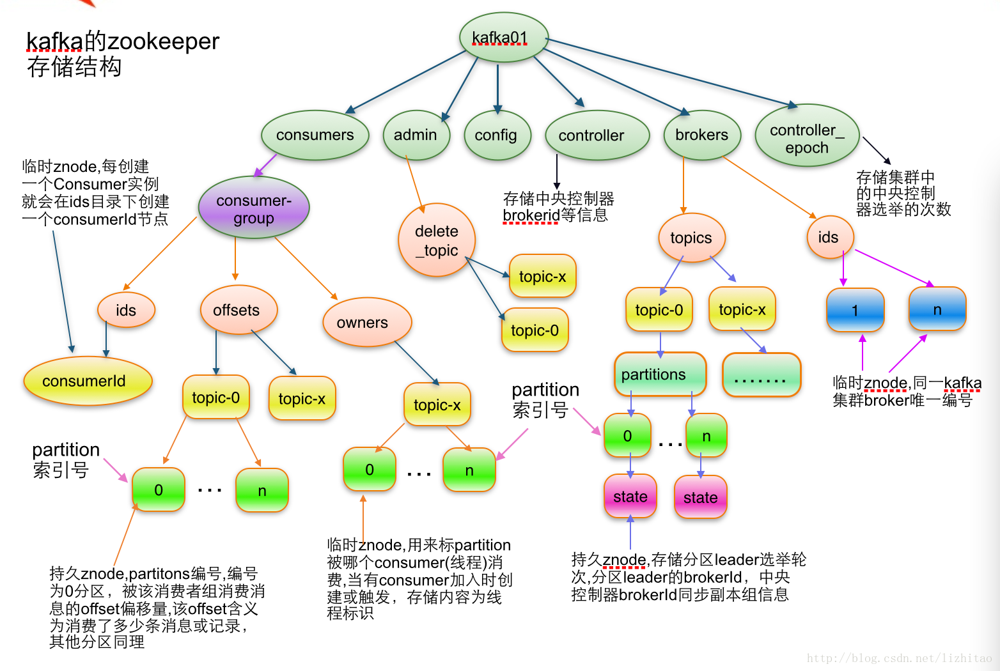

/
cluster
controller
brokers
    ids
    topics
    seqid
zookeeper
kafka-acl   ACL权限的信息
    Cluster
    Group
        test-group
    Topic
        quickstart-events
    TransactionalId
    DelegationToken
kafka-acl-changes
admin
isr_change_notification
log_dir_event_notification
controller_epoch
feature
kafka-acl-extended
kafka-acl-extended-changes
consumers
latest_producer_id_block
config
    changes
    clients
    brokers
    topics
    users   权限用户的信息

A),消费者目录,获取子节点就可以获取所有的消费者
/consumers/group.id/ids/
/consumers/group.id/offsets/
/consumers/group.id/owners/

B),topic的目录，可以获取topic，分区及副本信息
/brokers/topics/topicName
/brokers/ids/topicName

kafka在Zookeeper上的节点如下图：

具体见网址：
http://blog.csdn.net/lkforce/article/details/77864472

