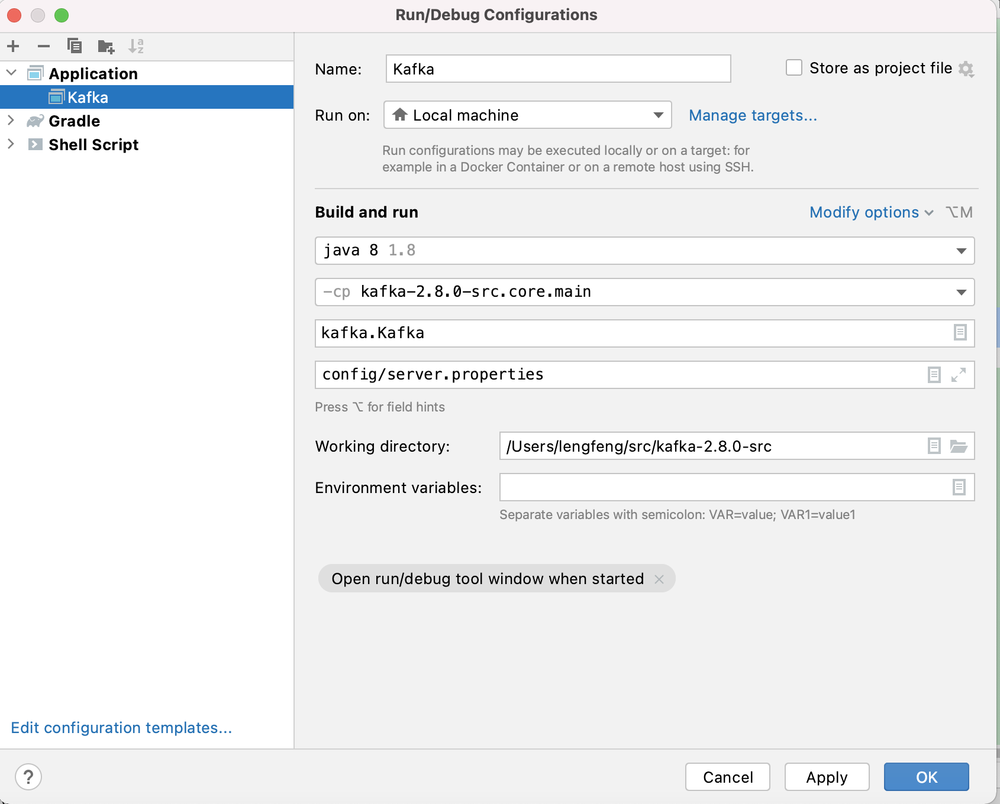

## Kafka 2.8.0 源码环境搭建


### 基础环境安装
1. 安装JDK
2. 下载gradle
3. 安装对应版本的Scala，比如Kafka 2.8.0使用的是scala-sdk-2.13.5


[Scala安装参考](https://github.com/youngzil/quickstart-framework/tree/master/quickstart-scala)


### 配置环境变量（可选）

可选，比如在IDEA中使用就不需要，在本地命令行还是加上比较方便

安装完 JDK、scala 以及 gradle 之后，我们打开命令行，跳转到当前用户的根目录，打开 bash_profile

在 bash_profile 文件中配置 JAVA_HOME、SCALA_HOME、GRADLE_HOME 三个环境变量，并将它们添加到 PATH 变量上

接下来，保存 bash_profile 文件，并执行 source 命令刷新文件：

最后，执行 java -version，scala -version 以及 gradle -version命令，检查一下环境变量是否配置成功，


## 安装 Zookeeper

因为Kafka依赖Zookeeper 

安装Zookeeper，并启动，我们可以就起一个单节点的


## Kafka安装

1. 下载 kafka 源码
2. 将 kafka 源码导入到 IDEA 中，可能比较耗时，我本机测试使用了十几分钟，可能配置好点的机器会好点吧
3. 检查选择的Scala版本是否匹配：IDEA选择"File"------》"Project Structure"------》SDKs 添加Scala SDK，选择Scala的路径即可
4. 配置日志
    -  config 目录下的 log4j.properties 配置文件拷贝下到 src/main/resources下面
    - 替换log4j.properties文件中的${kafka.logs.dir}到本地路径
    - 在根目录下的build.gradle中搜project(':core')，找到dependencies添加
   ```aidl
    // 添加以下两个依赖
    compile group: 'org.slf4j', name: 'slf4j-api', version: '1.7.32'
    compile group: 'org.slf4j', name: 'slf4j-log4j12', version: '1.7.32'
    ```
5. 接下来，我们修改 conf 目录下的 server.properties 文件，将修改其中的 log.dir 配置项，将其指向 kafka 源码目录下的 kafka-logs 目录
6. 最后，我们在 IDEA 中配置 kafka.Kafka 这个入口类，启动 kafka broker，具体配置如下图所示：
7. 启动成功的话，控制台输出没有异常，且能看到如下输出：  
   [2021-07-22 14:06:56,491] INFO [KafkaServer id=0] started (kafka.server.KafkaServer)
8. 发送、消费 message验证功能


### 可能遇到的问题
1. 不能编译，IDEA中直接使用插件安装的可能是最新版本，可Kafka使用的版本不一致，比如最新版本是3.0，Kafka2.8.0使用的是scala-sdk-2.13.5
2. 启动日志不能输出，build.gradle中dependencies没有添加slf4j-log4j12
3. log4j.properties文件中的${kafka.logs.dir}变量没有替换


参考  
[2、kafka 2.8.0 源码环境搭建](https://xie.infoq.cn/article/ece8077adf7f6e8aaca047da9)  
[深入Kafka源码01: 入门、Kafka2.0源码搭建(Gradle配置)](https://blog.csdn.net/qq_36269641/article/details/109737157)  
[Kafka2.0 源码阅读环境搭建](https://blog.csdn.net/x3x2012/article/details/82623575)  


